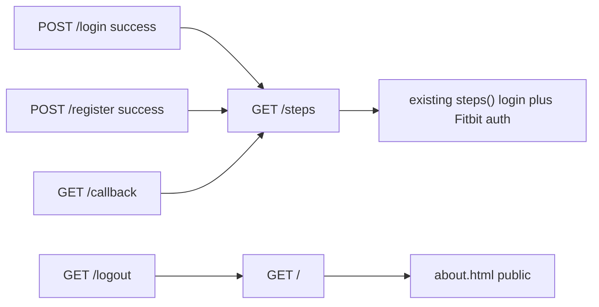

# About home, GitHub link, Fitbit disclaimer

Agreed approach: **split routes**. `/` is always About (including the navbar brand when logged in). Steps lives at `/steps`. After login, register, or Fitbit OAuth, send users to `/steps`. Logout can land on About.

## Routing

In `app.py`:

- Add a public `index()` at `@app.route("/")` that renders a new `templates/about.html` (no `login_required`).
- Move the current `steps()` view from `/` to `/steps`; keep `@login_required` and `@auth_required`.
- Change post-success redirects from `"/"` to `"/steps"` in register (~line 449), login (~line 497), and Fitbit callback (~line 595).
- Leave logout redirect as `"/"` so users return to About, not Login.

In `templates/layout.html`:

- Keep brand `href="/"`.
- Change the Steps nav item from `href="/"` to `href="/steps"`.
- Add a GitHub nav link for **both** logged-in and logged-out nav: [https://github.com/claudia-liauw/health-app](https://github.com/claudia-liauw/health-app), `target="_blank"` and `rel="noopener noreferrer"`. Place it in the right-side (`ms-auto`) list (with Profile/Log Out, or Register/Log In).

## About page

New `templates/about.html`, same Bootstrap card/layout style as login/register.

Copy: the README one-liner — steps, sleep, heart rate; step/sleep goals; inactive heart-rate anomaly detection; Fitbit; AI chat sidebar. Plus a GitHub button/link to the same repo URL.

At the bottom of the About page, a one-liner: **This is not medical advice.**

## Register Fitbit default

In `templates/register.html`:

- Remove `checked` from the Fitbit checkbox so **no Fitbit is the default** (`has_fitbit` already comes from `'fitbit' in request.form` in `app.py`, so an unchecked box still saves `False`).
- Under the checkbox, a hidden note (e.g. Bootstrap `form-text` / `alert-warning`) with exact text: **Untested with other Fitbit devices**.
- Small inline script: on checkbox `change`, show the note when checked, hide when unchecked. Informational only; submit is never blocked.

## Tests

Dashboard tests currently `GET "/"` (and `/?date=...`) expecting Steps. Point those at `/steps` (and `/steps?date=...`) in:

- `tests/test_login.py` — dashboard cases; `test_login_redirects_to_authenticate` should `GET /steps`; **`test_logout_clears_session` must change**: after logout, `/` is public (200 About), so assert `/steps` redirects to `/login` instead.
- `tests/test_goals.py` — step-goal cases that hit `/`.
- `tests/test_date_picker.py` — all steps date-picker URLs.

Add a few new tests (login or a small `test_about.py`):

- Logged-out `GET /` is 200 and includes About copy (and not a login-required redirect).
- GitHub URL appears in the page (layout or About).
- Register GET: Fitbit checkbox is not checked; disclaimer text is in the HTML but not required to be visible in a JS-less test; POST without `fitbit` still creates a no-Fitbit user if that path is easy to assert.

Optional one-line README routes note: home is About, steps is `/steps`. Only if you already touch README for accuracy; skip a docs-only rewrite.

## Implementation todos

1. Move steps to `/steps`; public About at `/`; redirect login/register/callback to `/steps`; logout stays `/`.
2. Navbar Steps + GitHub; new `about.html` from README description, with not-medical-advice at the bottom.
3. Unchecked Fitbit checkbox + show/hide disclaimer text.
4. Retarget dashboard tests to `/steps`; fix logout assertion; add About/GitHub/register defaults tests.

## Out of scope

No change to Fitbit OAuth, chat, sleep/heart routes, or database schema.
